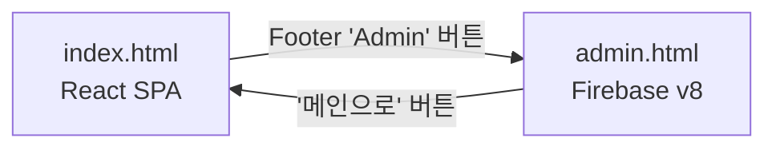

# 프로젝트 정리 및 Index-Admin 상호작용 검토 완료

## 1. 불필요한 파일 정리 ✓

### trash 폴더로 이동된 파일들

다음 파일들이 `trash/` 폴더로 이동되었습니다:

1. **임시 문서 파일**
   - `DIAGNOSIS_REPORT.md` - 초기 진단 리포트
   - `FIX_INSTRUCTIONS.md` - 수정 지침
   - `CLEANUP_COMPLETED.md` - 이전 정리 완료 문서
   - `ADDITIONAL_CLEANUP_TASKS.md` - 추가 정리 작업
   - `CHANGELOG_STRUCTURE_CLEANUP.md` - 구조 정리 변경 로그
   - `PROJECT_STRUCTURE_ANALYSIS.md` - 프로젝트 구조 분석

2. **Ternary 관련 임시 파일**
   - `ternary_issues.txt` - Ternary 이슈 목록
   - `ternary_mapping.txt` - Ternary 매핑 정보
   - `verify_ternary.py` - Ternary 검증 Python 스크립트

3. **테스트 스크립트**
   - `test-local.sh` - 로컬 테스트 스크립트

### 유지된 유용한 문서

- `LOCAL_TESTING.md` - Firebase Emulator 로컬 테스트 가이드 (유지)
- `CNAME` - 커스텀 도메인 설정 (필수)

## 2. Index-Admin 상호작용 검토 및 수정 ✓

### 현재 상호작용 구조



### Index → Admin 이동

**위치**: `src/App.jsx` (8516번째 줄)

```javascript
<button
    onClick={(e) => {
        e.preventDefault();
        e.stopPropagation();
        window.location.href = 'admin.html';
    }}
    className="hover:text-dark opacity-50 hover:opacity-100 transition-opacity"
    title="관리자 페이지"
>
    Admin
</button>
```

**작동 방식**: Footer에 "Admin" 버튼 클릭 시 `admin.html`로 이동

### Admin → Index 이동

**위치**: `public/admin.html` (6355, 6439번째 줄)

```javascript
// 위치 1: 로그인 폼 (6355번째 줄)
<button
    onClick={() => window.location.href = 'index.html'}
    className="w-full mt-4 py-3 border-2 border-gray-200 text-gray-600 rounded-xl font-bold hover:bg-gray-50 transition-colors"
>
    메인 페이지로 이동
</button>

// 위치 2: 관리자 대시보드 (6439번째 줄)
<button
    onClick={() => window.location.href = 'index.html'}
    className="px-4 py-2 bg-gray-100 hover:bg-gray-200 rounded-lg font-bold text-gray-700 transition-colors"
>
    메인으로
</button>
```

**작동 방식**: 로그인 전/후 모두 메인 페이지로 돌아가는 버튼 제공

### 빌드 시 경로 처리

**Vite 빌드 구조**:
```
빌드 전:
- index.html (루트)
- public/admin.html
- public/assets/*

빌드 후 (dist/):
- index.html (Vite 빌드)
- admin.html (public에서 복사)
- assets/* (public/assets에서 복사)
```

**Firebase Hosting Rewrites** (`firebase.json`):
```json
"rewrites": [
  {
    "source": "admin.html",
    "destination": "/admin.html"
  },
  {
    "source": "**",
    "destination": "/index.html"
  }
]
```

- `admin.html` 접근 시 → `dist/admin.html` 제공
- 그 외 모든 경로 → `dist/index.html` 제공 (React SPA 라우팅)

### admin.html 의존성 파일

**수정 사항**: 누락된 `config.js` 파일 생성 ✓

admin.html이 로드하는 JS 파일들:
1. `firebase-config.js` ✓ (있음)
2. `firebase-service.js` ✓ (있음)
3. `auth-service.js` ✓ (있음)
4. `config.js` ✓ (신규 생성)
5. `utils.js` ✓ (있음)

모든 파일이 `public/assets/js/` 경로에 존재합니다.

### CORS 설정

**로컬 개발 환경 허용** (`functions/index.js`):
```javascript
const allowedOrigins = [
  'https://bcsa.co.kr',
  'https://bcsa-b190f.web.app', 
  'https://bcsa-b190f.firebaseapp.com',
  'http://localhost:3000',  // Vite 기본 포트
  'http://localhost:3001',  // Vite 대체 포트
  'http://localhost:5173',  // Vite v4+ 기본 포트
  'http://127.0.0.1:3000',
  'http://127.0.0.1:3001',
  'http://127.0.0.1:5173'
];
```

## 3. 검증 방법

### 로컬 개발 환경 테스트

1. **Frontend 개발 서버 시작**
   ```bash
   npm run dev
   ```

2. **브라우저에서 테스트**
   - `http://localhost:3000` 접속
   - Footer에서 "Admin" 버튼 클릭
   - `http://localhost:3000/admin.html`로 이동 확인
   - admin 페이지에서 "메인으로" 버튼 클릭
   - `http://localhost:3000`로 돌아오는지 확인

### 프로덕션 환경 테스트

1. **빌드**
   ```bash
   npm run build
   ```

2. **dist 폴더 확인**
   ```bash
   ls -la dist/
   # index.html, admin.html, assets/ 모두 존재하는지 확인
   ```

3. **로컬 프리뷰**
   ```bash
   npm run preview
   ```
   - `http://localhost:4173` 접속
   - index ↔ admin 이동 테스트

4. **Firebase Hosting 배포**
   ```bash
   firebase deploy --only hosting
   ```
   - 실제 URL에서 테스트

## 4. 최종 프로젝트 구조

```
bcsa/
├── index.html (메인 진입점)
├── public/
│   ├── admin.html (관리자 페이지)
│   └── assets/
│       ├── js/
│       │   ├── firebase-config.js ✓
│       │   ├── firebase-service.js ✓
│       │   ├── auth-service.js ✓
│       │   ├── config.js ✓ (신규 생성)
│       │   └── utils.js ✓
│       └── images/ (파비콘 등)
├── src/ (React 앱)
│   ├── App.jsx
│   ├── components/
│   ├── hooks/ (useTenders.js 포함)
│   └── ...
├── functions/ (Firebase Functions)
│   └── index.js (조달청 API 프록시 + 캐싱)
├── firebase.json (Hosting + Functions 설정)
└── trash/ (불필요한 파일들)
```

## 5. 상호작용 체크리스트

- [x] index.html → admin.html 이동 버튼 존재
- [x] admin.html → index.html 이동 버튼 존재 (2곳)
- [x] admin.html 필수 의존성 파일 모두 존재
- [x] Vite 빌드 시 admin.html 복사 설정 (copyPublicDir: true)
- [x] Firebase rewrites 설정 (admin.html 별도 처리)
- [x] CORS 설정 (로컬 개발 환경 허용)
- [x] 불필요한 파일 trash 폴더로 이동

## 6. 주의사항

1. **admin.html 경로**: 빌드 후 `dist/admin.html`로 복사됨
2. **assets 경로**: admin.html 내에서 `./assets/...` 상대 경로 사용
3. **Firebase SDK 버전**: admin.html은 v8, src는 v10 사용 (정상)
4. **config.js**: .gitignore에 포함되어 있으므로, 배포 시 환경별로 설정 필요

모든 작업이 완료되었습니다.
